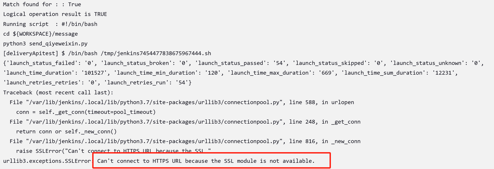
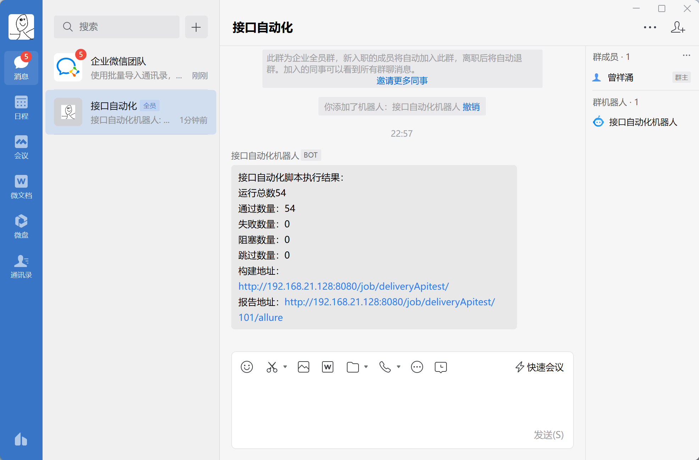
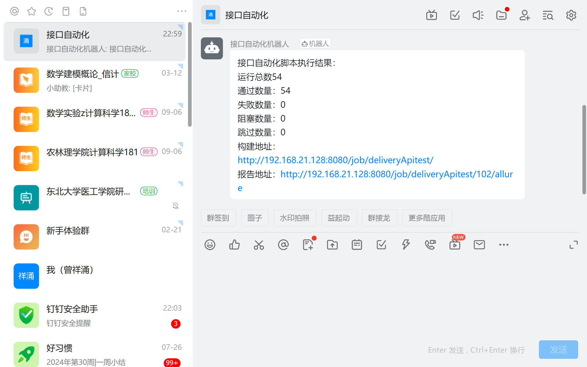
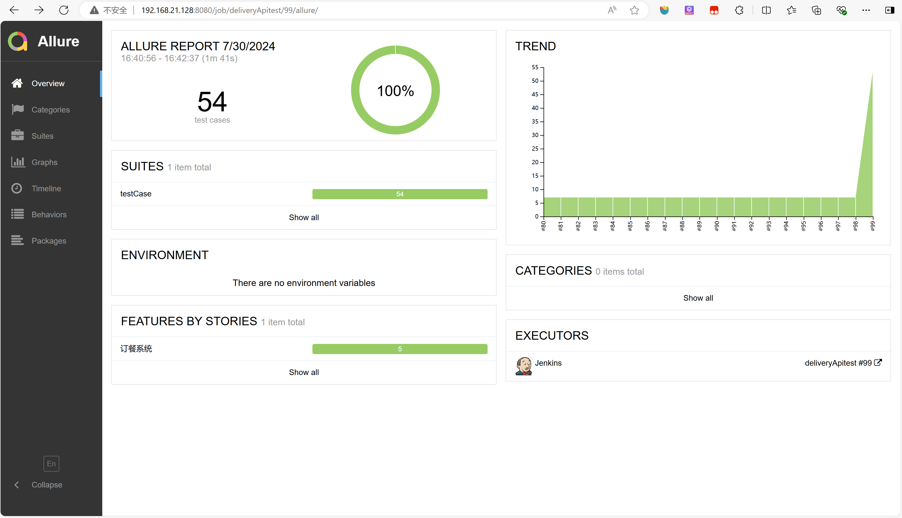

# 1.allure报告报错。

写完test_login测试脚本后试着运行但是报错

解决点是在 os.system 命令中用双引号包裹 {report_path} 变量，确保整个路径被视为一个字符串。因为打印了report_path路径是D:\Program Files\Delivery_System-master\outFiles\report\temp。虽然看似合理但问题就出在Program Files这两个单词有空格了。

命令行会将其解析为：
allure serve D:\Program和Files\Delivery_System-master\outFiles\report\temp
因此，命令会失败。修改之后，allure报告能成功打开。

# 2.安装完Jenkins启动时遇到的一些报错

## 2.1启动失败

报错信息（Job for jenkins.service failed because the control process exited with error code. See "systemctl status jenkins.service" and "journalctl -xe" for details.）
打印了日志没有发现error，考虑是不是jdk配置的有什么问题？

检查一下jdk配置
[root@localhost ~]# update-alternatives --config java

输出：java-1.7.0-openjdk.x86_64 (/usr/lib/jvm/java-1.7.0-openjdk-1.7.0.261-2.6.22.2.el7_8.x86_64/jre/bin/java)

java-1.8.0-openjdk.x86_64 (/usr/lib/jvm/java-1.8.0-openjdk-1.8.0.262.b10-1.el7.x86_64/jre/bin/java)

发现这里没有显示我的jdk11信息，既然安装了 JDK 11，需要将它添加到 update-alternatives 系统中，使用命令：

sudo update-alternatives --install /usr/bin/java java /usr/local/jdk-11.0.09/bin/java 1100

sudo update-alternatives --install /usr/bin/javac javac /usr/local/jdk-11.0.09/bin/javac 1100

并设为默认java版本：

sudo update-alternatives --config java

sudo update-alternatives --config javac

再restart一下Jenkins，启动成功。

## 2.2Jenkins启动成功，打开浏览器卡在初始界面（please wait while Jenkins...）

在csdn上搜索得知应该是Jenkins本地的源不稳定换一下国内的，使用命令：

vim /var/lib/jenkins/hudson.model.UpdateCenter.xml

把url换成https://mirrors.tuna.tsinghua.edu.cn/jenkins/updates/update-center.json 保存退出再systemctl restart jenkins，成功进入Jenkins界面。

# 3.在向钉钉/企业微信发送报告时报错ssl错误

考虑是centos7的python中ssl配置问题，回到centos7输入命令：

openssl version

OpenSSL 1.1.1n  15 Mar 2022

这说明系统已经安装了 OpenSSL 并且版本是 1.1.1n

但是打开python解释器输入

import ssl

print(ssl.OPENSSL_VERSION)

ModuleNotFoundError: No module named '_ssl'

问题就是这里虽然系统安装了但是Python 解释器在编译时没有正确配置 SSL 支持。所以重新配置一下。

1.进入 Python 源代码目录

cd /root/Python-3.7.2

2.配置和编译 Python

sudo ./configure --enable-optimizations --with-ssl

sudo make altinstall

3.重新启动 Python 解释器

python3

4.验证是否配置成功

import ssl

print(ssl.OPENSSL_VERSION)

配置成功，再次构建jenkins项目可以发送到钉钉和企业微信

目前jenkins构建稳定

